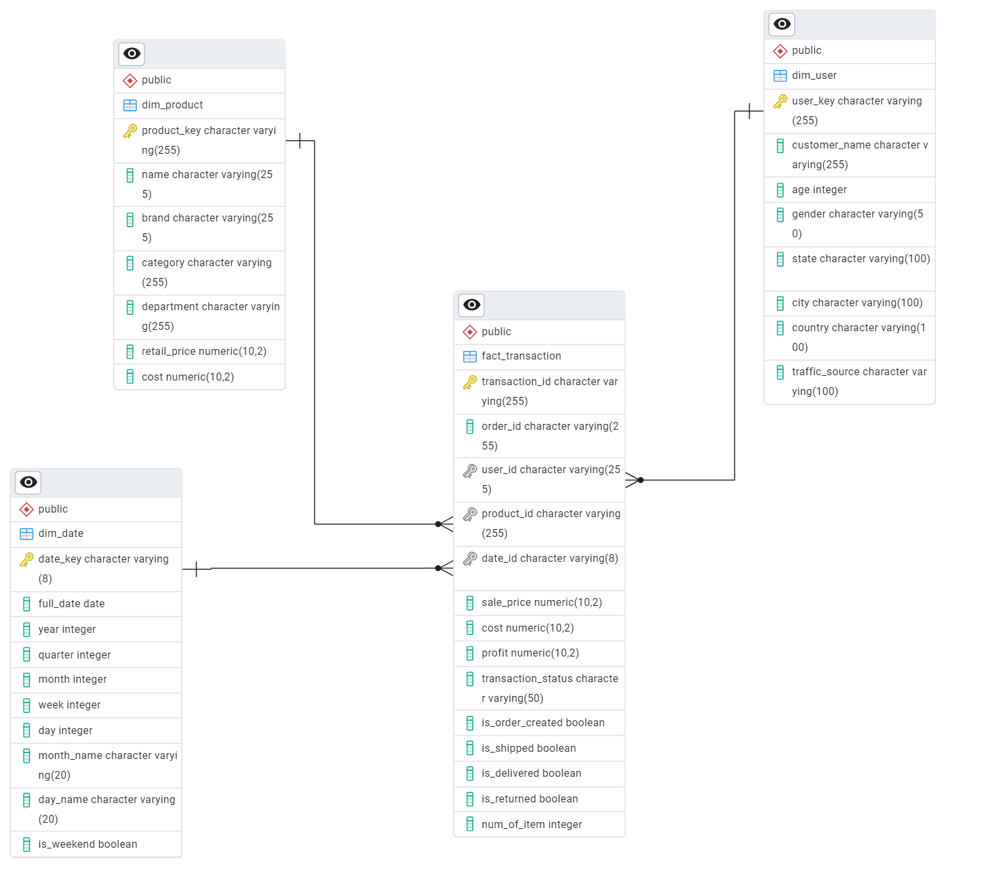

# The Look E-Commerce Data Warehouse & ETL Pipeline 
### Data Warehouse For Sales Analysis

This project implements an end-to-end ETL pipeline and Data Warehouse design for **The Look**, a fictional e-commerce platform. The solution uses **PySpark**, **PostgreSQL**, and **BigQuery SQL** to enable comprehensive sales data analytics.


## Project Overview

The objective of this project is to create a scalable data warehouse and ETL pipeline that supports analytical queries and reporting on e-commerce sales transactions.
The pipeline covers:

* Data extraction from BigQuery
* Data cleaning and transformation with PySpark
* Data Warehouse schema design using **Star Schema**
* Loading data into PostgreSQL
* Presenting the solution with Google Slides


## Objectives

* Extract relevant sales, product, user, and date data from BigQuery
* Transform and clean the data into structured formats
* Model the Data Warehouse using a Star Schema
* Load transformed data into PostgreSQL tables
* Enable business analysis on profitability, customer behavior, and sales trends


## Data Warehouse Design

**Star Schema** is implemented with one Fact Table and three Dimension Tables:


### Tables

#### **Fact Table**

* **fact\_transaction**

  * `transaction_id`
  * `order_id`
  * `user_id`
  * `product_id`
  * `date_id`
  * `sale_price`
  * `cost`
  * `profit`
  * `transaction_status`
  * `is_order_created`
  * `is_shipped`
  * `is_delivered`
  * `is_returned`
  * `num_of_item`

#### **Dimension Tables**

* **dim\_product**

  * `product_key`, `name`, `brand`, `category`, `department`, `retail_price`, `cost`
* **dim\_user**

  * `user_key`, `customer_name`, `age`, `gender`, `state`, `city`, `country`, `traffic_source`
* **dim\_date**

  * `date_key`, `full_date`, `year`, `quarter`, `month`, `week`, `day`, `month_name`, `day_name`, `is_weekend`




## ETL Process

### 1. Extract

SQL queries executed in **BigQuery**:

* Fact Transaction Data
* Product Dimension
* User Dimension
* Date Dimension

See [`BigQuery.sql`](BigQuery.sql) for full query details.


### 2. Transform

Data cleaning & transformation with **PySpark**:

* Rename and format columns
* Handle missing values
* Calculate derived metrics (e.g., `profit`)
* Ensure consistency across tables

All transformation steps are documented in the Notebook:

```
Notebook.ipynb
```

### 3. Load

Data Warehouse schema creation in **PostgreSQL**:

* Tables defined in [`datawarehouse_ddl.sql`](datawarehouse_ddl.sql)
* Constraints and foreign keys ensure data integrity
* Data loaded from PySpark DataFrames into PostgreSQL tables


## Example Analytical Queries

The warehouse enables queries such as:

* Top products by profit
* Monthly sales trends
* Return rates by product
* Average profit per gender

All sample queries are included in the SQL DDL file.


## How to Run the Project

1. **Clone this repository:**

   ```bash
   git clone https://github.com/amandarizki/Data-Warehouse-For-Sales-Analysis.git
   cd Data-Warehouse-For-Sales-Analysis
   ```

2. **Install dependencies:**

   ```bash
   pip install -r requirements.txt
   ```

3. **Start Jupyter Notebook:**

   ```bash
   jupyter notebook
   ```

4. **Execute the analysis cells in order.**


## Tech Stack

* PySpark
* PostgreSQL
* Google BigQuery
* SQL

## Author

Amanda Rizki Koreana

---

*This project was developed to practice data engineering and analytics workflows.*

```
